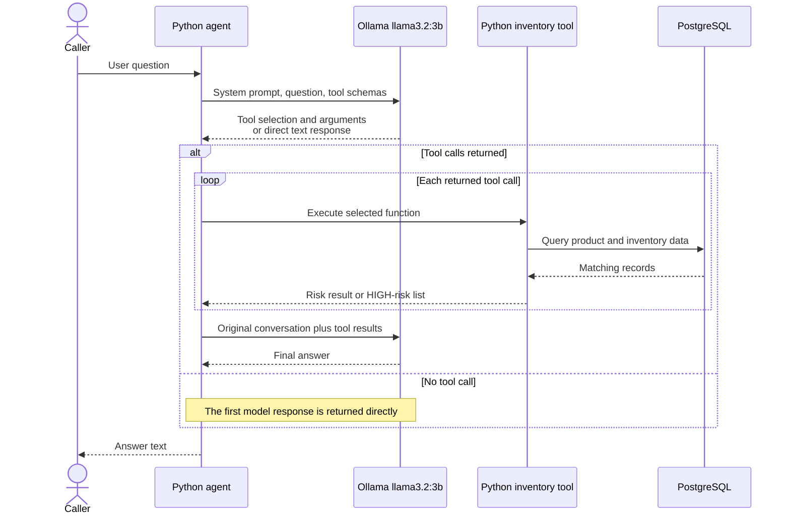

# Inventory agent workflow

`investigate_inventory_risk()` is a Python function in `agents/inventory_agent.py`. No HTTP route currently calls it.

```mermaid
sequenceDiagram
    actor Caller
    participant Agent as Python agent
    participant LLM as Ollama llama3.2:3b
    participant Tool as Python inventory tool
    participant DB as PostgreSQL

    Caller->>Agent: User question
    Agent->>LLM: System prompt, question, tool schemas
    LLM-->>Agent: Tool selection and arguments<br/>or direct text response
    alt Tool calls returned
        loop Each returned tool call
            Agent->>Tool: Execute selected function
            Tool->>DB: Query product and inventory data
            DB-->>Tool: Matching records
            Tool-->>Agent: Risk result or HIGH-risk list
        end
        Agent->>LLM: Original conversation plus tool results
        LLM-->>Agent: Final answer
    else No tool call
        Note over Agent,LLM: The first model response is returned directly
    end
    Agent-->>Caller: Answer text
```
