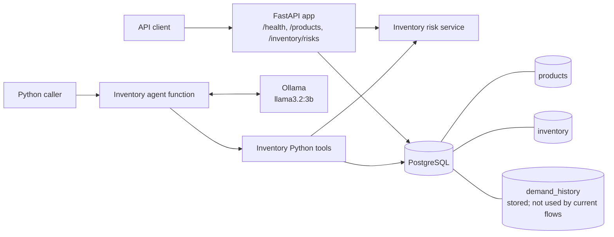

# OpsPilot architecture

This diagram reflects the current implementation. The FastAPI service and Python agent share PostgreSQL, but the agent is not exposed through the API.

```mermaid
flowchart LR
    Client[API client] --> API[FastAPI app<br/>/health, /products, /inventory/risks]
    API --> Risk[Inventory risk service]
    API --> DB[(PostgreSQL)]

    Caller[Python caller] --> Agent[Inventory agent function]
    Agent <--> LLM[Ollama<br/>llama3.2:3b]
    Agent --> Tools[Inventory Python tools]
    Tools --> DB
    Tools --> Risk

    DB --- Product[(products)]
    DB --- Inventory[(inventory)]
    DB --- Demand[(demand_history<br/>stored; not used by current flows)]
```
