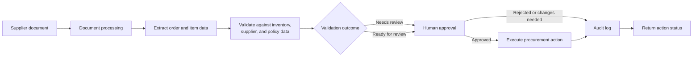

# Proposed future workflow (not implemented)

The following is an example of a possible procurement or supply-chain extension. None of these steps currently exist in OpsPilot.

```mermaid
flowchart LR
    Source[Supplier document] --> Process[Document processing]
    Process --> Extract[Extract order and item data]
    Extract --> Validate[Validate against inventory,<br/>supplier, and policy data]
    Validate --> Decision{Validation outcome}
    Decision -->|Needs review| Human[Human approval]
    Decision -->|Ready for review| Human
    Human -->|Approved| Action[Execute procurement action]
    Human -->|Rejected or changes needed| Audit[Audit log]
    Action --> Audit
    Audit --> Status[Return action status]
```
